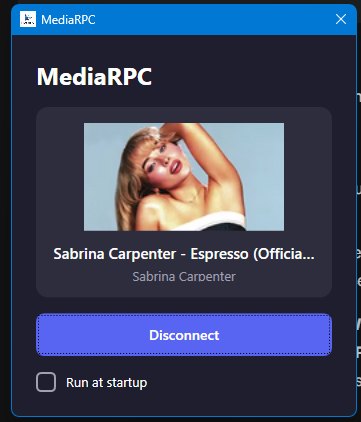

# MediaRPC.Wpf

A minimal Windows application that displays your currently playing media on Discord Rich Presence using the Windows SMTC (System Media Transport Controls) API.



## Features

- 🎵 **SMTC Integration** - Intercepts media metadata from browsers and desktop apps
- 💬 **Discord Rich Presence** - Shows "Listening to [Title] by [Artist]" on your Discord status
- 🖼️ **Album Art Display** - Shows thumbnail in the app (supports horizontal and square images)
- 🚀 **Run at Startup** - Optional auto-start with Windows (starts minimized and auto-connects)
- 📌 **System Tray** - Minimizes to tray on close, exit via right-click menu
- 🔒 **Single Instance** - Prevents multiple instances from running

## Requirements

- Windows 10/11
- .NET 8.0 Runtime
- Discord Desktop App

## Installation

### From Release
1. Download the latest release
2. Extract and run `MediaRPC.exe`

### Build from Source
```powershell
git clone https://github.com/danyooooo/MediaRPC.Wpf.git
cd MediaRPC.Wpf
dotnet build -c Release
```

## Usage

1. **Launch the app** - The main window shows currently playing media
2. **Click "Connect"** - Enables Discord Rich Presence
3. **Play media** - Any browser or desktop app with SMTC support will be detected
4. **Check "Run at startup"** - App will auto-start minimized and connect on Windows startup

### Supported Media Sources
- Any browser with Media Session API (Chrome, Edge, Firefox, etc.)
- Spotify, Windows Media Player, VLC, and other SMTC-enabled apps

## Configuration

Settings are stored in `%APPDATA%\MediaRPC\settings.json`

## Tech Stack

- **Framework**: WPF (.NET 8.0)
- **Media Detection**: Windows.Media.Control API (SMTC)
- **Discord Integration**: [DiscordRichPresence](https://github.com/Lachee/discord-rpc-csharp) v1.6.1.70
- **System Tray**: [Hardcodet.NotifyIcon.Wpf](https://github.com/hardcodet/wpf-notifyicon)

## License

MIT License - see [LICENSE](LICENSE) for details
