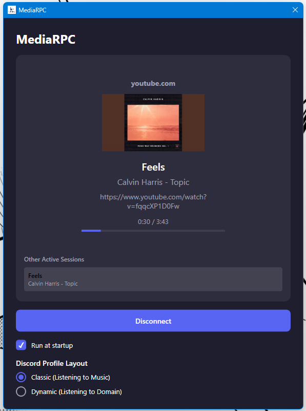
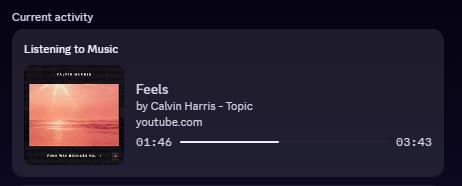
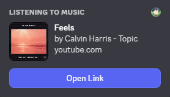

# MediaRPC

A minimal Windows application and companion browser extension that displays your exact media playback on Discord Rich Presence. 

<div align="center">
  
  
  
</div>

Unlike standard SMTC-based (System Media Transport Controls) apps that only pull basic metadata, MediaRPC uses a custom WebSocket browser extension to extract full media data directly from the official Media Session API. This allows it to synchronize live playback duration timestamps, extract beautiful high-resolution album artwork, display the source domain, and construct direct "Open Link" action buttons right in your Discord status!

## Features

- 🌐 **Full Extension Integration** - Uses a zero-install, unpacked Chrome/Edge extension to safely pipe native browser media over local WebSockets.
- 💬 **Discord Rich Presence** - Shows what you are listening to on your Discord status.
- 🎨 **Two Unique Layouts** - Instantly toggle between:
  - **Classic**: The traditional `"Listening to Music"` header.
  - **Dynamic**: A custom header that cleanly displays the specific source domain (`"Listening to youtube.com"`).
- ⏱️ **Live Timeline Sync** - Perfect duration progress bar visually ticking inside your Discord presence.
- 🔗 **Actionable "Open Link" Button** - Automatically adds a clickable button to your Discord profile so friends can instantly tune in with you.
- 🖼️ **WPF Desktop UI** - A sleek, modern dashboard that displays current play state, artwork, local playback progress, and a list of your other concurrent media sessions.
- 🔄 **Auto-Connect** - Automatically detects when Discord starts, connects, and elegantly disconnects when you close it.

## Requirements

- Windows 10/11
- .NET 8.0 Runtime
- Discord Desktop App
- Chromium-based Browser (Chrome, Edge, Brave, etc.)

## Installation & Setup

### 1. Build and Run the App
```powershell
git clone https://github.com/danyooooo/MediaRPC.Wpf.git
cd MediaRPC.Wpf
dotnet build -c Release
```
*Run the `MediaRPC.exe`. The application automatically spins up a local WebSocket listener.*

### 2. Install the Browser Extension
1. Open your Chromium browser (Chrome/Edge) and navigate to the Extensions page (`chrome://extensions/` or `edge://extensions/`).
2. Enable **Developer mode** in the top right corner.
3. Click **Load unpacked**.
4. Select the `ChromeExtension` folder located inside your cloned `MediaRPC` directory.
5. *Done! The extension will automatically connect to the WPF app via WebSockets. No native messaging registry hacks required!*

> ⚠️ **Note on Incognito Mode:** If you enable "Allow in incognito" for the extension, you **must restart your browser** for it to properly take effect. Otherwise, the extension will encounter a "context invalidated" error and fail to connect until restarting.

## Configuration

Settings and cache are stored in `%APPDATA%\MediaRPC\`:
- `settings.json` - Application settings (Startup behavior and selected Discord Layout).
- `cache.png` - Cached thumbnail (temporary, used to push high-res artwork to Discord).

## Tech Stack

- **Framework**: WPF (.NET 8.0)
- **Media Detection**: Windows.Media.Control API (SMTC)
- **Discord Integration**: [DiscordRichPresence](https://github.com/Lachee/discord-rpc-csharp) v1.6.1.70
- **System Tray**: [Hardcodet.NotifyIcon.Wpf](https://github.com/hardcodet/wpf-notifyicon)

## License

GNU General Public License v3.0 - see [LICENSE](LICENSE) for details
